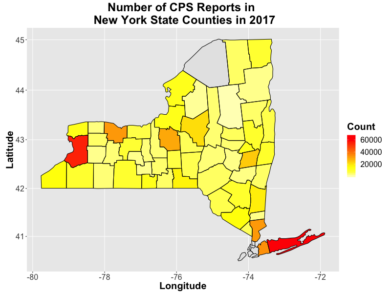
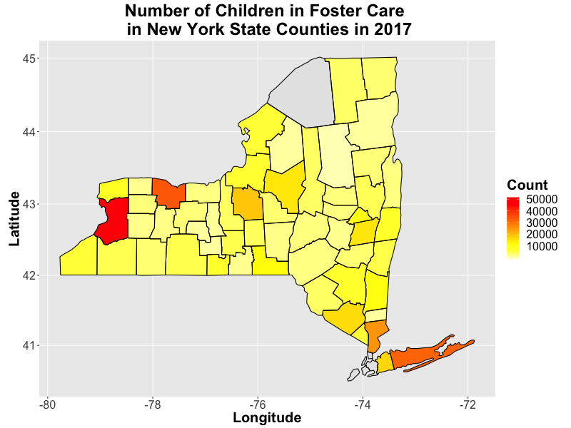
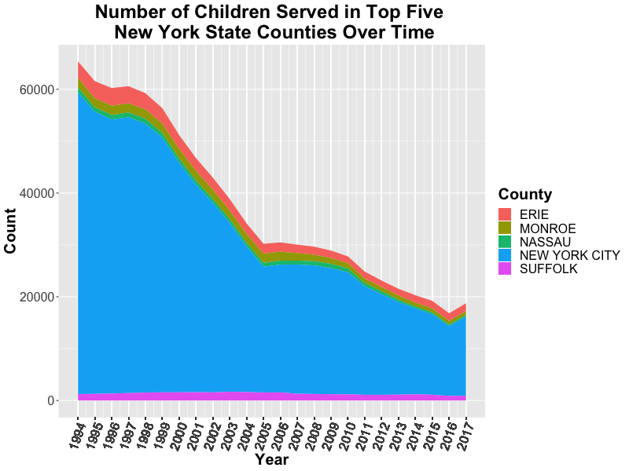

# **Analyzing NYS Children in Foster Care Annually**

## Jane Stout, Ph.D.

The New York State [(NYS) Children in Foster Care Annually database] contains information on the total number of admissions, discharges, and children in foster care, the type of care, and total Child Protective Services (CPS) reports indicated each year in the state. The data have been collected from 1994-2017. I used R programming language to conduct the analyses and visualizations in this report.

As seen in Figure 1, while CPS Reports have remained steady over time, the number of children who are served by foster care has fallen over time. It is interesting (and perhaps disturbing) to note that, starting in 2006, the number of CPS reports outweighed the number of children in foster care.

**Figure 1. Number of Children in Foster Care and CPS Reports in the State of New York Over Time**

We can look at the rate at which CPS reports occur and the rate at which children are served by foster care by NYS counties. See Figure 2a and 2b, respectively, for rates in 2017. These figures show that CPS reporting and foster care occurrence are particularly concentrated in some counties (e.g., New York City). Further, higher CPS reporting rates tend to be more strongly associated with higher foster rates (i.e., darker shaded counties tend to co-occur in Figures 2a and 2b).

**Figure 2a. Number of CPS Reports in New York State Counties in 2017**

**Figure 2b. Number of Children in Foster Care in New York State Counties in 2017**

When we observe the rate at which CPS reporting and fostering have occurred over time for counties with the top five CPS reporting rates in 2017, we see that New York City has the most activity (see Figures 3a and 3b). Consistent with Figure 1, while fostering activity has declined over time, CPS reporting has not. Rather, CPS reporting appears to be increasing over time.

**Figure 3a. Count of CPS Reports in Top Five New York State Counties Over Time**.

**Figure 3b. Number of Children Served in Top Five New York Counties Over Time**

Children are placed in a variety of foster home environments, including the following:

- **Adoptive Home**
  - This includes adoptive and/or adoption subsidized homes.
- **Agency Operated Boarding Home**
- **Approved Relative Home**
  - The relative has been approved as a foster parent.
- **Foster Boarding Home**
- **Group Home**
  - Congregate Care home
- **Group Residence**
  - These are also considered congregate care for youth.
- **Institution**
  - This facility type is a larger facility for congregate care.
- **Supervised Independent Living**
  - Young adults have been approved by Office of Children and Family Services (OCFS) to live on their own.
- **Other**
  - Residential treatment facilities, skilled nursing facilities, specialized schools, etc.

As seen in Figure 4, children tend to spend the most time in foster boarding homes, followed by approved relatives' homes, followed by institutions.

**Figure 4. Number of Care Days Provided for Housing Arrangements in New York State in 2017**

## Summary

This analysis highlighted the following about the state of New York foster system:
1. While foster placement rates have dropped over time, CPS reports have increased.
2. New York City shows by far the highest prevalence of CPS reports and fostering.
3. The most common type of foster housing is boarding homes, followed by approved relative homes and institutions.

[(NYS) Children in Foster Care Annually database]: https://www.kaggle.com/new-york-state/nys-children-in-foster-care-annually

[my code]: nys-children.R
