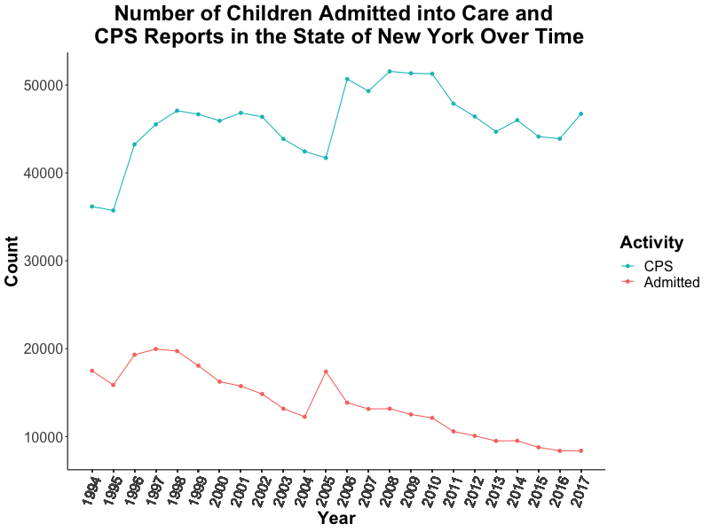
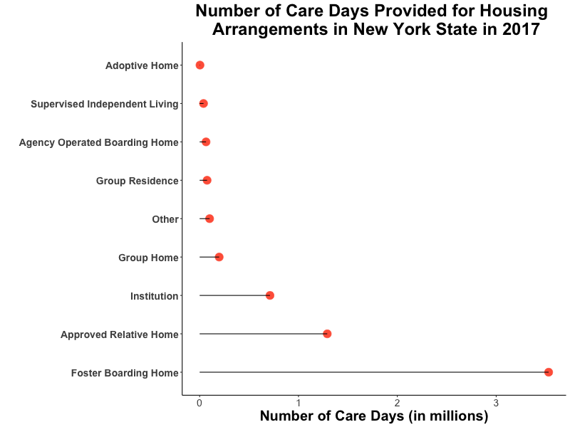

# **Analyzing Annual NYS Foster Care Data**

## Jane Stout, Ph.D.
#### Updated June 19 2019

The New York State [(NYS) Children in Foster Care Annually database] contains information on the total number of admissions, discharges, and children in foster care, the type of care, and total Child Protective Services (CPS) reports indicated each year in the state. The data have been collected from 1994-2017. I used R programming language to conduct the analyses and visualizations in this report (the code is found [here](code.R)).

As seen in Figure 1, there is a wide discrepancy in the number of annual CPS reports and the number of children who are actually admitted to foser care. Specifically, the rate at which children are admitted to foster care is far lower than the rate at which CPS Reports occur. For instance, in 2017, while 46,726 CPS Reports were filed, only 8,375 children were actually admitted to foster care. This trend is consistent with the [CPS's guide for parents], indicating that "...a report is a statement of concern; it is not an accusation." That is, a CPS report is a starting place for an investigation, which may or may not result in a child being put in foster care. The data in Figure 1 indicate that most CPS reports do not result in admission into foster care.

**Figure 1. Number of Children in Foster Care and CPS Reports in the State of New York Over Time**

When we observe the rate at which CPS reporting and foster admittance have occurred over time for counties with the top five CPS reporting rates in 2017, we see that New York City has the most activity (see Figures 2a and 2b). Consistent with Figure 1, while foster admittance has declined over time, CPS reporting has not. Rather, CPS reporting appears to be increasing over time.

**Figure 2a. Count of CPS Reports in Top Five New York State Counties Over Time**.

**Figure 2b. Number of Children Served in Top Five New York Counties Over Time**

It is interesting to observe the rate at which children are admitted to foster care, given the number of CPS reports for each NY county. Figure 3 shows that, with only a few exceptions, the proportion of admitted children given the number of CPS reports in 2017 is quite low (less than .3).

**Figure 3. Number of CPS Reports in New York State Counties in 2017**

Furthermore, there appears to be no relationship between a [county's population] and the rate at which children are admitted to foster care, given the number of CPS reports. Figure 4 shows this lack of relationship. For instance, we see that New York City has the highest population of all counties, but falls in the middle of counties in terms of foster addmitance/CPS reports. Further, St. Lawrence County has the highest foster admittance/CPS reports proportion of all counties, but it's population is similar to many counties in NY State.

**Figure 4. Scatterplot of County Population and the Proportion of Children Admitted into Foster Care Given the Number of CPS Reports in 2017**

The data also indicate that children are placed in a variety of foster home environments, including the following:

- **Adoptive Home**
  - This includes adoptive and/or adoption subsidized homes.
- **Agency Operated Boarding Home**
- **Approved Relative Home**
  - The relative has been approved as a foster parent.
- **Foster Boarding Home**
- **Group Home**
  - Congregate Care home
- **Group Residence**
  - These are also considered congregate care for youth.
- **Institution**
  - This facility type is a larger facility for congregate care.
- **Supervised Independent Living**
  - Young adults have been approved by Office of Children and Family Services (OCFS) to live on their own.
- **Other**
  - Residential treatment facilities, skilled nursing facilities, specialized schools, etc.

As seen in Figure 5, children tend to spend the most time in foster boarding homes, followed by approved relatives' homes, followed by institutions.

**Figure 5. Number of Care Days Provided for Housing Arrangements in New York State in 2017**

## Summary

This analysis highlighted the following about the state of New York foster system:
1. There is not a 1:1 relationship between foster admission rates CPS reports; CPS reporting does not necessarily result in foster care admittance.
2. Counties do differ in their foster care admittance rate, given the number of CPS reports in a given year, and this rate does not correlate with county population.
3. The most common type of foster housing is boarding homes, followed by approved relative homes and institutions.

[(NYS) Children in Foster Care Annually database]: https://www.kaggle.com/new-york-state/nys-children-in-foster-care-annually

[CPS's guide for parents]: https://www.preventchildabuseny.org/resour/parents/guide-child-protective-services

[county's population]: https://www.newyork-demographics.com/counties_by_population
